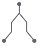
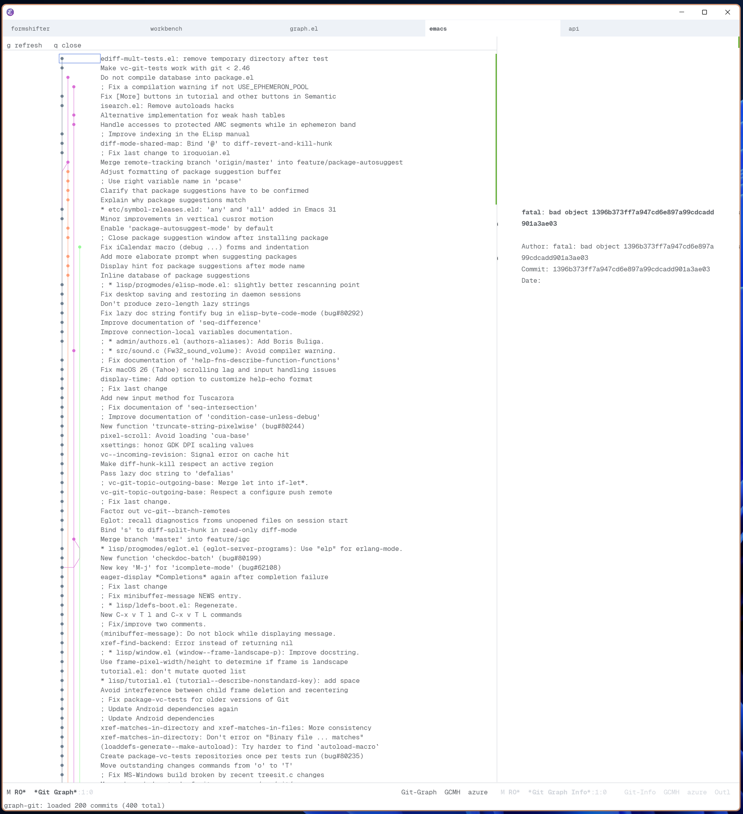

#+title: graph.el

* Overview

=graph.el= is a small library for building grid-based graphs inside
Emacs.

You provide the layout:
- nodes have =:row= and =:col=
- edges are polylines through grid points
- renderers decide how to draw that geometry

The repository includes:
- =graph.el= for the core graph data structures and text rendering
- =graph-svg.el= for SVG rendering
- =graph-git.el= for Git history graphs built on top of the core library

* Constructing A Graph Manually

The core API is intentionally small:

- ~graph-create~
- ~graph-add-node~
- ~graph-add-edge~
- ~graph-open~

Rows and columns are zero-based integers.

** Minimal Example

#+begin_src emacs-lisp :results raw
(add-to-list 'load-path default-directory)
(require 'graph)

(let ((g (graph-create)))
  (graph-add-node g
                  :id 'root
                  :row 0
                  :col 2
                  :data '(:label "root"))
  (graph-add-node g
                  :id 'left
                  :row 3
                  :col 0
                  :data '(:label "left"))
  (graph-add-node g
                  :id 'right
                  :row 3
                  :col 4
                  :data '(:label "right"))
  (graph-add-edge g
                  :from 'root
                  :to 'left
                  :points '((0 . 2) (1 . 2) (2 . 1) (3 . 0)))
  (graph-add-edge g
                  :from 'root
                  :to 'right
                  :points '((0 . 2) (1 . 2) (2 . 3) (3 . 4)))
  (with-temp-buffer
    (graph-view-mode)
    (graph-view-set-graph g)
    (princ (concat "#+begin_example\n"
                   (buffer-string)
                   "#+end_example\n"))))
#+end_src

#+RESULTS:
#+begin_example
  o  
  |  
 / \ 
o   o
#+end_example

That renders directly into the Org results block. If you want the same graph in
its own interactive buffer, replace the final ~with-temp-buffer~ form inside
the ~let~ block with:

#+begin_src emacs-lisp
(graph-open g "*Example Graph*")
#+end_src

** What The Coordinates Mean

A node is placed at a single grid position:

#+begin_src emacs-lisp
(graph-add-node g :id 'a :row 3 :col 2)
#+end_src

An edge is a list of points that forms a polyline:

#+begin_src emacs-lisp
(graph-add-edge g
                :from 'a
                :to 'b
                :points '((3 . 2)
                          (4 . 2)
                          (5 . 3)
                          (6 . 3)))
#+end_src

Each consecutive pair of points becomes one segment.

* Using The SVG Renderer

If you want an image instead of character cells, require =graph-svg= and call
=graph-svg-image= or =graph-svg-render=.

#+begin_src emacs-lisp :results file graphics :file readme-svg-example.svg
(add-to-list 'load-path default-directory)
(require 'graph)
(require 'graph-svg)

(let ((g (graph-create))
      (graph-svg-edge-width 2.0))
  (graph-add-node g :id 'a :row 0 :col 2)
  (graph-add-node g :id 'b :row 4 :col 0)
  (graph-add-node g :id 'c :row 4 :col 4)
  (graph-add-edge g
                  :from 'a
                  :to 'b
                  :points '((0 . 2) (1 . 2) (2 . 1) (3 . 1) (4 . 0))
                  :face 'default)
  (graph-add-edge g
                  :from 'a
                  :to 'c
                  :points '((0 . 2) (1 . 2) (2 . 3) (3 . 3) (4 . 4))
                  :face 'default)
  (let* ((render (graph-svg-render g))
         (svg (car render))
         (file (expand-file-name
                "readme-svg-example.svg"
                (file-name-directory (or buffer-file-name default-directory)))))
    (with-temp-file file
      (svg-print svg))
    file))
#+end_src

#+RESULTS:

Evaluating that block writes an SVG file and inserts it as the result.

The SVG renderer uses these main custom variables:

- ~graph-svg-x-step~
- ~graph-svg-y-step~
- ~graph-svg-padding~
- ~graph-svg-node-radius~
- ~graph-svg-edge-width~

* Building Git-Like Layouts

Nothing in =graph.el= is Git-specific. A Git history view is just a graph where:

- each commit is a node
- rows correspond to commit order
- columns correspond to active lanes
- parent relationships become edges

The important idea is that layout happens before rendering. For example:

#+begin_src emacs-lisp :results raw
(add-to-list 'load-path default-directory)
(require 'graph)

(let ((g (graph-create)))
  ;; Newest commit in lane 0.
  (graph-add-node g :id 'c3 :row 0 :col 0)
  ;; Side branch commit in lane 1.
  (graph-add-node g :id 'c2 :row 2 :col 1)
  ;; Mainline parent back in lane 0.
  (graph-add-node g :id 'c1 :row 4 :col 0)

  ;; Merge-looking edge.
  (graph-add-edge g
                  :from 'c3
                  :to 'c1
                  :points '((0 . 0) (1 . 0) (2 . 0) (3 . 0) (4 . 0)))
  ;; Side branch flowing back.
  (graph-add-edge g
                  :from 'c3
                  :to 'c2
                  :points '((0 . 0) (1 . 0) (2 . 1)))
  (with-temp-buffer
    (graph-view-mode)
    (graph-view-set-graph g)
    (princ (concat "#+begin_example\n"
                   (buffer-string)
                   "#+end_example\n"))))
#+end_src

#+RESULTS:
#+begin_example
o 
| 
|o
| 
o 
#+end_example

* Git UI Notes

=graph-git.el= adds a Git history browser on top of the core library.

History is loaded asynchronously and fetches more commits as you move near the
end of the buffer.

#+attr_html: :width 600px

